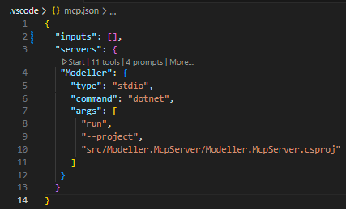
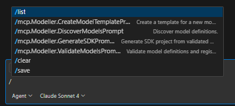

# Modeller MCP - Intelligent Domain Modeling & Code Generation

## Overview

Modeller MCP is a cutting-edge platform designed to streamline domain modeling and accelerate code generation by
leveraging Behaviour-Driven Development practices alongside the power of Large Language Models. It enables developers to
effortlessly transform structured domain definitions into robust, production-ready .NET SDKs and Minimal APIs, all
architected with modern best practices such as the Vertical Slice Architecture. This integration of AI-driven automation
and rigorous validation tools helps ensure code quality, security, and maintainability at scale.

### Key Capabilities

🤖 **LLM-Driven Code Generation**: Generate complete .NET projects from domain models using AI  
📋 **Domain Model Validation**: Comprehensive schema validation and business rule checking  
🔄 **Intelligent Code Modification**: Update existing code while preserving custom developer changes  
🎯 **Vertical Slice Architecture**: Generate complete feature slices using custom prompts  
📊 **Model Context Protocol**: Integrate with VS Code, GitHub Copilot, Claude desktop and other AI development tools  
🛡️ **Safety & Quality**: Built-in security guards, validation pipelines, and rollback capabilities

## Architecture

### Current State (Production-Ready)

- ✅ **YAML Schema Creation**: Prompts and tools to help build domain models
- ✅ **VS Code Integration**: IntelliSense and schema support for model authoring
- ✅ **YAML Schema Validation**: Comprehensive validation of domain models
- ✅ **Business Rule Checking**: Validation of model constraints and relationships  
- ✅ **MCP Integration**: Model Context Protocol server for AI tool integration
- ✅ **Prompt-Based Analysis**: AI-powered model analysis and recommendations
- ✅ **Security Framework**: Enterprise-grade security for LLM interactions
- ✅ **Audit Logging**: Comprehensive audit trails for compliance and monitoring
- ✅ **Secure Code Generation**: LLM-driven code generation with security controls

#### Prompt Templates
- ✅ **SDK Generation**: Complete .NET SDK generation from domain models
- ✅ **Minimal API Generation**: Full API projects with SDK integration

### Advanced Features (Ready for Integration)

- ✅ **Intelligent Code Generation**: Transform models into .NET code
- ✅ **Security Context Validation**: Multi-level security validation and sanitization
- ✅ **Prompt Injection Prevention**: Advanced protection against malicious prompts
- ✅ **Immutable Response Tracking**: Tamper-proof recording of all LLM interactions
- ✅ **Post-Generation Validation**: Automated validation of generated code quality
- ✅ **Enterprise Audit Support**: Full audit trails for regulatory compliance

## Quick Start

### Prerequisites

- Visual Studio Code (recommended[^1])
- .NET SDK (latest stable)
- **YAML** extension for VS Code

[^1] It does work in other IDEs but the experience is still best in VS Code.

### Installation

```bash
# Clone the repository
git clone https://github.com/CSharp-Catalyst/ModellerMcp.git
cd ModellerMcp

# Build the MCP server
dotnet build src/Modeller.McpServer

# Run the MCP server
dotnet run --project src/Modeller.McpServer
```
Alternate start is to open the `.vscode/mcp.json` file in vs code and click start



### Basic Usage

#### 1. Finding and validating model definitions

Using Github Copilot and the `/` command.  Alternately, just type (or talk) asking it to perform the thing you want.  The `/` commands just build a prompt for you. 



```bash
# Discover all models in your project
/mcp.Modeller.DiscoverModelPrompt

# Validate a specific domain
Validate the structure and models you just found
```
You are using the power of the LLM models, they interpret the request using the available tools, and then perform the action.

#### 2. SDK Code Generation

```bash
# Generate complete .NET SDK from domain models
Generate the SDK project from the models you have validated
```

#### 3. Minimal API Generation

```bash
# Generate complete Minimal API project that uses the generated SDK
Using the SDK and the validated models create a minimal api
```

---

## Project Structure

```text
ModellerMcp/
├── models/                          # Domain model definitions
│   └── Business/                   # Organization namespace
│       ├── CustomerManagement/    # Example domain
│       │   ├── _meta.yaml
│       │   ├── Customer.Type.yaml
│       │   ├── Activity.Type.yaml
│       │   └── ...
│       └── Shared/                 # Shared types and enums
│           ├── AttributeTypes/
│           └── Enums/
├── src/
│   ├── Modeller.McpServer/         # MCP server implementation
│   └── Modeller.Mcp.Shared/       # Shared libraries and services
│       ├── CodeGeneration/         # SDK and API generation services
│       ├── Tools/                  # MCP tools for validation and generation
│       └── Services/               # Core business services
├── tests/                          # Unit and integration tests
├── docs/                           # Documentation
│   ├── code-generation-design.md   # LLM-driven code generation design
│   ├── sdk-api-generation-guide.md # Complete generation workflow guide
│   ├── yaml-schema-intellisense-guide.md
│   └── modeller-mcp-prompts-guide.md
└── schemas/                        # JSON schemas for validation
```

## Development Workflow

### 1. Model Definition

- Define domain models using YAML with IntelliSense support
- Validate models using comprehensive schema validation
- Use BDD scenarios for business rule specification

### 2. AI-Powered Analysis

- Leverage the MCP tools with VS Code and GitHub Copilot
- Get intelligent suggestions for model improvements
- Analyze cross-model consistency and best practices

### 3. Code Generation

- Generate LLM Prompts for code generation
- Use the prompts for LLM-driven code generation
- Enterprise-grade audit logging and compliance tracking
- Multi-level security validation and prompt injection prevention
- Use any supported prompt packages (I'm using my Vertical Slice Architecture sample)
- Maintain developer customizations during updates

## Model Definition Best Practices

The validation tools and supplied documents (bdd_model_definitions.md) will provide good guidance  

Some considations:
- **Naming**: Use PascalCase for types, camelCase for attributes
- **Structure**: Separate entity types (`.Type.yaml`) and behaviours (`.Behaviour.yaml`)
- **Reusability**: Leverage shared attribute types and enums
- **Documentation**: Provide clear summaries and descriptions
- **Validation**: Use BDD scenarios for business rules
- **Consistency**: Follow established domain patterns

---

## Documentation

### Core Guides

- [SDK & API Generation Guide](docs/sdk-api-generation-guide.md) - Complete
  workflow from models to running applications
- [Code Generation Design](docs/code-generation-design.md) - LLM-driven code
  generation architecture
- [BDD Model User Guide](docs/BDD_Model_User_Guide.md) - Comprehensive
  modeling guide
- [MCP Prompts Guide](docs/modeller-mcp-prompts-guide.md) - AI integration
  usage
- [YAML Schema Guide](docs/yaml-schema-intellisense-guide.md) - Schema and
  IntelliSense setup

### Technical References

- [Model Definition Specification](docs/bdd_model_definition.md) - YAML format
  reference
- [Security Implementation Status](docs/security-implementation-status.md) -
  Enterprise security features

---

## Contributing

This project uses advanced AI-driven development practices. When contributing:

1. **Model Changes**: Validate all models before committing
2. **Code Generation**: Test generated code thoroughly
3. **Documentation**: Update guides to reflect changes
4. **AI Integration**: Ensure MCP tools work correctly

---

## Roadmap

### Current Release - COMPLETED

- ✅ YAML schema validation and IntelliSense
- ✅ MCP server integration with AI tools
- ✅ Comprehensive model analysis prompts
- ✅ Enterprise-grade security framework implementation
- ✅ LLM-driven secure code generation with audit logging
- ✅ Prompt injection prevention and security validation
- ✅ Immutable response tracking and compliance support
- ✅ Complete .NET SDK generation from domain models
- ✅ Minimal API generation with SDK integration
- ✅ VSA pattern implementation for generated code

### Next Release

- 🎯 Production deployment and integration testing
- 🎯 Enhanced code modification with safety checks
- 🎯 Developer workflow and tooling integration
- 🎯 Advanced template marketplace and community contributions

### Future Releases

- 🔮 Multi-language code generation support
- 🔮 Advanced AI code optimization and learning
- 🔮 Community template marketplace
- 🔮 Advanced enterprise governance and policy management

---

*For questions or support, please raise an issue in the repository or contact
the development team.*
